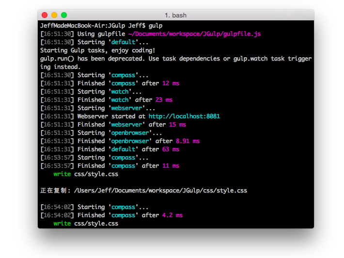

# JGulp:利用Gulp 配置的前端项目自动化工作流
====

> JGulp 是本人利用Gulp 配置的适合自己的一个前端项目自动化工作流，目前正在实践运用中（通俗说用得还挺爽）。如果你有需要，可以参考本工作量构建适合自己的工作流。跪求Star，欢迎Fork！

> 文章介绍：http://devework.com/jgulp.html

## 功能模块（插件）

> 小标题含义：功能（对应的Gulp 插件）

### Compass（gulp-compass）

一个Sass 框架，本工作流主要是Compass + Sass，因此熟悉这两者是使用本工作流的基础条件。

### Sass（gulp-sass）

Sass 是与 Less 并举的 CSS 预处理器，一种全新的CSS 编码方式。

### 本地Web 服务器功能（gulp-webserver + tiny-lr）

能够让你的当前项目目录映射到Localhost 上，本功能主要是为了添加自动刷新（livereload）功能而添加。

### 网页自动刷新功能（gulp-livereload）

这个功能毫无疑问是最实用的，借助本livereload 模块，一旦监控到有文件改动就自动刷新页面。需要[安装相应的Chrome 扩展](https://chrome.google.com/webstore/detail/livereload/jnihajbhpnppcggbcgedagnkighmdlei?hl=zh-CN)配合使用。

### JS 文件合并（gulp-concat）

### JS 文件压缩（gulp-uglify）

### 图片无损压缩1（gulp-imagemin + imagemin-pngquant）

经过实际使用发现，图片压缩略有损失，但基本无碍。

### 图片无损压缩2：Tinypng 形式（gulp-tinypng）

借用[tinypng](http://tinypng.org/) 的官方API 进行压缩，支持png、jpg 格式，后续通过 `gulp build2` 命令即可自动调用。因为服务器在国外原因，有时候会很慢。

### 文件清理功能（gulp-clean）

在项目完成可以删除一些多余的文件

### 任务错误中断自动重传（gulp-plumber）

好吧，“任务错误中断自动重传”是我瞎命名的。默认的 Gulp 任务在执行过程中如果出错会报错并立即停止当前工作流（如在 watch Sass编译时候恰巧 Sass代码写错了）。使用plumber 模块可以在纠正错误后继续执行任务。

### 自动打包并按时间重命名（gulp-zip）

一般项目完成后需要整理文件并压缩以供交付使用或进行下一阶段的开发，本模块可以实现将项目文件自动打包并按时间重命名。

### 自动上传文件到远程FTP 服务器（gulp-sftp）

完成开发后，可通过本命令自动上传文件到远程FTP 服务器，以供在线调试

### 其他（gulp-copy、gulp-rename、opn）

其他杂项模块为该Gulp 添加文件复制、文件重命名、浏览器自动打开项目目录等基础功能

> 注：

> 1.因为CSS 代码主要是通过Compass 框架完成，所以本工作流不涉及CSS 压缩等其他功能模块（因为这些功能Compass 本身已经包含）。

> 2.后续多次用于实战项目后可能会有增减，即不断完善之以让个人前端工作效率最大化。

## 使用方法

1.  请先确保已经安装Gulp(需要 Node.js 环境) ，建议采用下面的代码全局安装

		$ npm install --global gulp 

2. 进入你的项目文件夹下`clone` 本 git 项目

		$ git clone https://github.com/Jeff2Ma/JGulp.git

   `clone` 后建议删除残留的`.git` 缓存文件夹，方便添加自己的Git 版本信息管理：
   
  		$ rm -rf .git  
		
3. 安装相关Node 模块

	在项目文件夹目录下通过下面命令安装相关Node 模块

		npm install 

4. 按照个人的项目需求，重命名`JGulp` 文件夹为你自己的项目英文名称，填写`Project.md `文件（`Project.md`文件在项目最终打包的时候会自动重命名为`README.md`保存在`build` 文件夹），填写`package.json` 文件的项目名称部分。如果需要进一步的个性化，可以编辑`gulpfile.js` 文件。

5. 进行相关配置（如果有需要用到相关功能）：为了安全，将重要的配置信息保存到项目目录下的一个json 文件中，名为 `config.json`，该文件示例代码如下：

		{
			"project" : "Gulp", 	
			"localserver" : {
    			"host" : "localhost",
    			"port" : "8081"
  			},
 			"tinypngapi": "Tinypng API KEY",
 			"sftp" : {
    			"host" : "8.8.8.8",
    			"user" : "username",
   				"port" : "22",
    			"key" : "~/.ssh/sdfsfdsf",
    			"remotePath" :"/"
 			}
		}   
相关内容（项目别名、本地服务器域名+端口、[Tinypng API KEY](https://tinypng.com/developers)、ftp相关信息）请自行配置，为保证安全，`config.json`文件已经添加到`.gitignore `文件中。
		
6. 然后捏，就基本上可以的了，默认任务：

		$ gulp
	
7. 如果项目已经完成，可以通过`build` 命令进行项目相关文件收集，项目文件最终会汇集到项目目录下的`build` 文件夹中方面进一步操作

		$ gulp build

	如果需要调用Tinypng 的图片压缩，那么命令需改为：

		$ gulp build2

8. 打包`build` 文件夹下的项目文件，会自动生成`项目别名-xxxx.zip` 的文件（`xxxx` 为打包时候的时间）供交付使用或进行下一阶段的开发

		$ gulp zip
		
9. 如果要上传到远程服务器进行线上调试，可以通过该命令自动上传（需提前在 `config.json`做好配置 ）：

		$ gulp upload 

